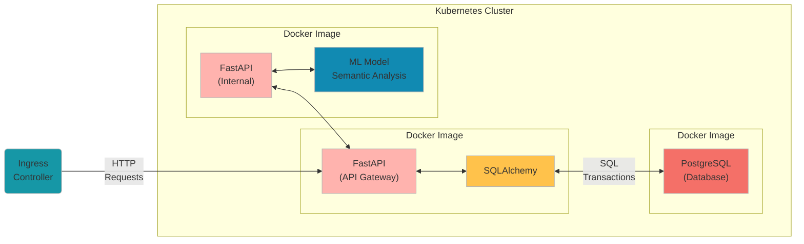

## The Project Architecture

```mermaid


flowchart LR

	n00(Ingress <br/> Controller)
	subgraph g20["Kubernetes Cluster"]
		subgraph h00[" "]
			subgraph g10["Docker Image"]
				n10["FastAPI <br/> (API Gateway)"]
				n20["SQLAlchemy"]
			end
			subgraph g11["Docker Image"]
				n30["PostgreSQL <br/> (Database)"]
			end
			subgraph g12["Docker Image"]
				n11["FastAPI <br/> (Internal)"]
				n40["ML Model <br/> Semantic Analysis"]
			end
		end	
	end
	
	n00 -- HTTP <br/> Requests ----> n10
	n10 <--> n20
	n20 <-- SQL <br/> Transactions --> n30
	n11 <--> n10
	n11 <--> n40

	classDef node0Style fill:#1697a6, stroke:#B4B4B4
	classDef node1Style fill:#ffb3ae, stroke:#B4B4B4
	classDef node2Style fill:#ffc24b, stroke:#B4B4B4
	classDef node3Style fill:#f47068, stroke:#B4B4B4
	classDef node4Style fill:#118ab2, stroke:#B4B4B4
	classDef hiddenStyle fill:transparent, stroke:transparent
	class n00,n01,n02,n03,n04,n05,n06,n07,n08,n09 node0Style;
	class n10,n11,n12,n13,n14,n15,n16,n17,n18,n19 node1Style;
	class n20,n21,n22,n23,n24,n25,n26,n27,n28,n29 node2Style;
	class n30,n31,n32,n33,n34,n35,n36,n37,n38,n39 node3Style;
	class n40,n41,n42,n43,n44,n45,n46,n47,n48,n49 node4Style;
	class h00,h01,h02,h03,h04,h05,h06,h07,h08,h09 hiddenStyle;
	
	
```
