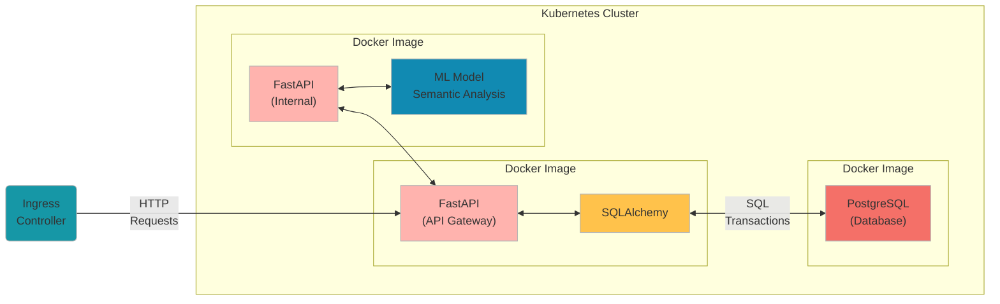

# AIKube

AIKube is a mini-project that demonstrates deploying a FastAPI-based application, a machine learning model, and a PostgreSQL database within a Kubernetes cluster. The project also incorporates Docker and Kubernetes configuration for seamless DevOps integration.

---

## Features

- **FastAPI**:
  - RESTful API for text analysis.
  - Integrates with a machine learning model for sentiment analysis.
  - Stores results in a PostgreSQL database.
  
- **Machine Learning Model**:
  - Sentiment analysis using Hugging Face's transformers.
  - Deployed as a separate microservice.

- **PostgreSQL**:
  - Serves as the database backend for storing text and sentiment data.

- **Kubernetes Deployment**:
  - Kubernetes manifests for FastAPI, ML model, and PostgreSQL.
  - Configured with `NodePort` and `ClusterIP` services for internal and external communication.

---

## Architecture

The application consists of the following components:

1. **FastAPI App**:
   - Handles API requests for text analysis.
   - Communicates with the ML model service.

2. **ML Model**:
   - Provides sentiment analysis as a microservice.

3. **PostgreSQL**:
   - Stores text and sentiment results.

The application is containerised using Docker and orchestrated with Kubernetes.



---

## Setup

### Prerequisites

- Docker Desktop with Kubernetes enabled.
- Kubernetes CLI (`kubectl`).
- A running Docker registry (local or remote).

---

### Steps to Run

1. **Clone the Repository**
```bash
git clone <repository-url>
cd aikube
```

2. **Build Docker Images**
```bash
docker build -t localhost:5002/aikube-fastapi_app:latest ./fastapi_app
docker build -t localhost:5002/aikube-ml_model:latest ./ml_model
 ```

3. **Push Images to Local Registry**
```bash
docker push localhost:5002/aikube-fastapi_app:latest
docker push localhost:5002/aikube-ml_model:latest
```

4. **Deploy to Kubernetes**
```bashApply all Kubernetes manifests:
kubectl apply -f kubernetes/
```

5. **Verify Deployment**
Check the status of all pods and services:
```bash
kubectl get pods
kubectl get services
 ```

6. **Access the Application**
Use the assigned NodePort to interact with the FastAPI app. For example:
```bash
curl -X POST http://localhost:<NodePort>/analyse_text \
-H "Content-Type: application/json" \
-d '{"text": "I love Kubernetes!"}'
File Structure
 ```
